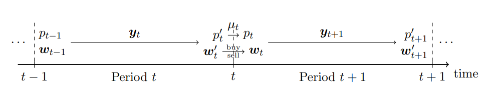
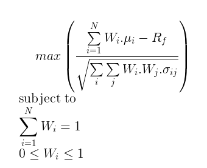
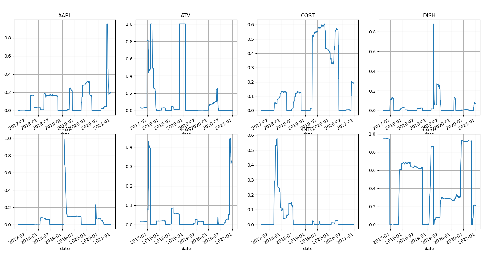
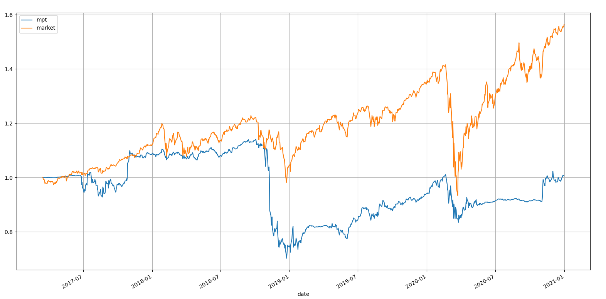
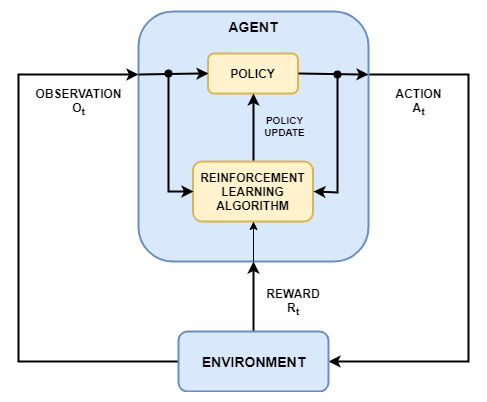
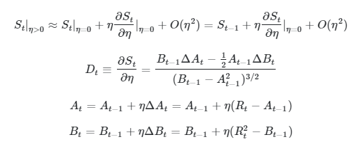
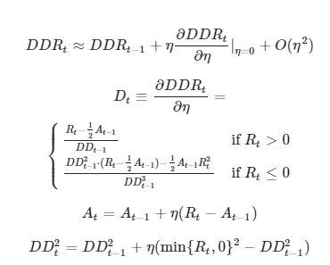
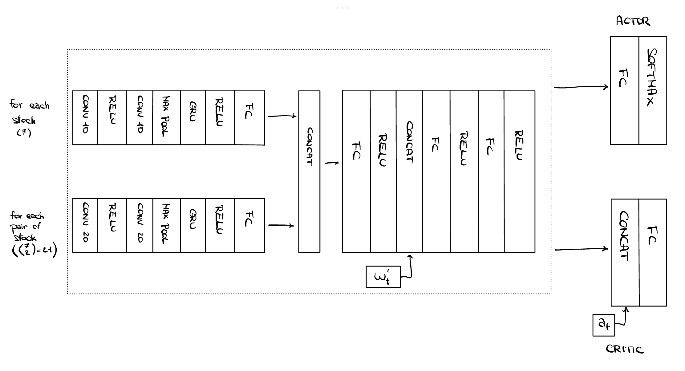
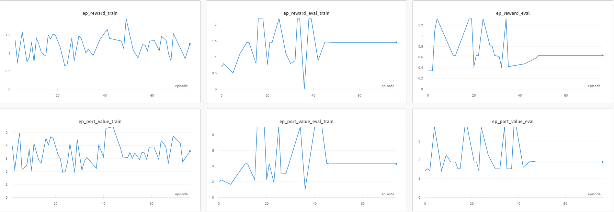

# Thesis objective
Comparison between classic portfolio optimization methods (e.g. Markowitz) and (deep) reinforcement learning algorithms (e.g. DDPG, SAC)
# Assumpitons

- Trading volume of portfolio is not large enough to influence the price of the stocks
- 0 slippage: expected price of trade == actual price of trade
- Portfolio is rebalanced at the end of every trading day and the weights are used for the next trading day
- Starting portfolio is 1$ in cash
- Trading strategy doesn't depend on the actual value of the portfolio but only on the weights
- No shorting

# Market info

Market composed by $n=7$ risky assets (stocks chosen randomly from S&P500) and a risk-free asset (cash) with $r_f = 0$

Transaction cost: $0.2\%$ of transaction value for both buying and selling

Market data: daily OHLCV -> use only daily high ($p_t^h$), low ($p_t^l$) and close ($p_t$) prices

Period under analysis:
- from 2007-01-01 to 2016-12-31 for training RL agents
- from 2017-01-01 to 2020-12-31 for back-testing and comparing methods

# Portfolio definition and constraints

Defined as a vector where each element represents the percentage of the total portfolio value invested in a given asset.

- $w = [w_0, \dots, w_n]$
- $\sum_{i=0}^{n}w_i = 1$
- $w_i \geq 0 \space \forall i$

# Portfolio dynamics:

where:
- $w_{t-1}$ are the portfolio weights at the start of period $t$
- $w_t^{'}$ are the portfolio weights at the end of period $t$ before rebalancing
- $y_t$ is the vector of stock price changes
- $\mu_t$ is the multiplicative cost of transaction to pass from $w_t^{'}$ to $w_{t-1}$

# Markowitz strategy

- $R_f = 0$
- $\mu_i$ and $\sigma_{ij}$ are the sample mean and covariance calculated using the last 50 closing prices (current day included)

(market is SPY ETF that follows S&P500 index)

# RL framework

- environment: market + portfolio
- RL algorithm: DDPG or SAC
- action: weights for next trading day
- observation: last 50 high-low-close prices of all stocks + current portfolio weights just before rebalancing
- reward: log-return / differential sharpe ratio / differential downside deviation ratio

## Data preprocessing
Not interested in actual stock prices but only in relative changes

-> use "log-returns" as input for networks (divide current values by previous values and take log)

-> shapes:
- $s_t$: [3, 7, 50-1]
- $w_t^{'}$: [7+1]

## Network architecture

# Experiments

## Train actor-critic network using DDPG with log-return as reward signal

Converges to local optimum in which it invests all into one stock for the whole trading period

## Adding pre-training step

Before using RL algorithm, train actor network to mimic Markowitz strategy using training data (minimize L2 norm of difference between network's output and optimal Markowitz action) and then train using RL only the last FC layer.

Result: algorithm now converges to investing all into the best performing asset

## DDPG using differential sharpe ratio

Result: converges to another stock

# Planned but not yet implemented/done

- SAC algorithm
- Augmenting observations by adding prediction of next day prices/returns using, for example, ARIMA model
- Using different reward signals to penalize investing all into one stock and using the same strategy despite large losses
- Changing market environment to avoid including over-performing stocks that might skew results
- Reducing number of stocks to see if complexity influences the RL algorithms